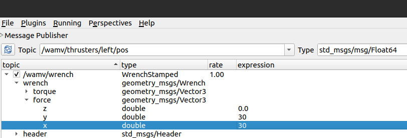

# vrx_wrench2thrust

## Simple procedure manual
1. `cd ouxt_ws`
2. `colcon build --packages-select vrx_wrench2thrust`
3. `source install/setup.bash`
4.  in another terminal, `source ~vrx_ws/install/setup.bash`,`ros2 launch vrx_gz competition.launch.py world:=sydney_regatta`
5.  back to original terminal ,`ros2 run vrx_wrench2thrust vrx_wrench2thrust_node`
5. in another terminal,`ros2 run rqt_topic rqt_topic`, and set value like this.

for now, Only respond to topic:`wamv/wrench`,data_field`wrench/force/x,y`.
 
